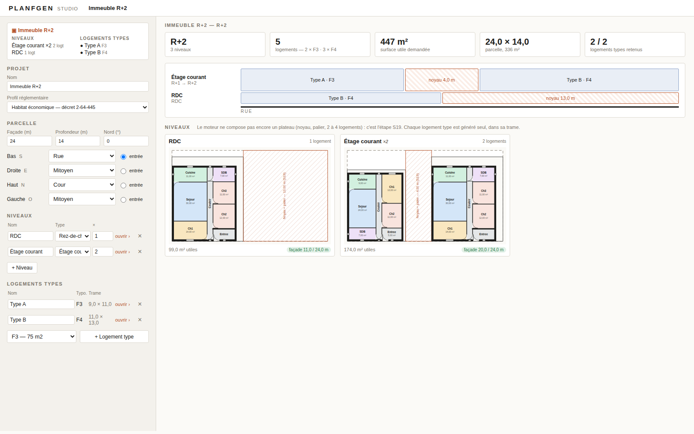

# PLANFGEN — studio web

A local web studio over the engine: a **project** (building → storeys → plates →
unit types → rooms), a **gallery of options** at the unit level generated in
parallel, and drawings that read as architectural plans — poché walls, doors with
their swing, windows, shafts, dimension chains, net areas in every stamp. French
throughout. The Streamlit studio (`planfgen/studio/app.py`) is untouched and still
works; this sits beside it.



## Run it

Once, on the agency PC (the same install the Streamlit studio already needs):

```bat
pip install -e ".[studio,dev]"
```

Then, from the repository root:

```bat
python -m web                 :: opens http://127.0.0.1:8765/ in the browser
web\start.bat                 :: the same, by double-click
python -m web --port 9000 --no-browser
```

Linux / macOS: `python -m web`. Tests: `python -m pytest planfgen/tests/test_web.py -q`.

No npm, no build, no CDN, no new Python package: it runs offline once the
`studio` extra is installed. Local only (127.0.0.1).

## Decision: Starlette + uvicorn, and a no-build SVG front-end

**Chosen.** A Starlette app served by uvicorn (`web/server.py`), a plain-function
adapter to the pipeline (`web/engine.py`, `web/project.py`), and a front-end of
three static files — `index.html`, `app.js`, `plan.js` (ES modules, no framework)
— that draws the plan as SVG from the same bridge document the Grasshopper
component reads (`to_gh_json`), plus the wall solids with their openings cut out.

Why, against the constraints that matter here:

| | Offline on a Windows PC | Gallery, parallel, streamed | State survives interaction | Direct manipulation (drag a wall) | Grows to storeys and 3D | Cost now |
|---|---|---|---|---|---|---|
| **Starlette + vanilla SVG (chosen)** | **Zero new deps**: Starlette and uvicorn ship with Streamlit, already in `[studio]`; static files, no build | Process pool (spawn), one request per option, each card fills as it returns | The page owns the state; `localStorage` on every change; server is stateless | SVG DOM is hit-testable; drag handlers are ordinary JS | `plateSVG` already composes flats; three.js can be vendored as one ES-module file, no build | ~1 day, done |
| Stay on Streamlit | Yes | Reruns the script per interaction; a gallery of N live cards fights the model | `session_state` patches (S24) | **No canvas**: a report viewer, not a design tool | No | — |
| FastAPI + React/Svelte SPA (Vite) | npm at build time, or ship a built bundle and a toolchain nobody at the agency can rebuild offline | Yes | Yes | Yes (Konva / SVG) | Yes (react-three-fiber) | Weeks; a JS toolchain to maintain |
| NiceGUI | pip only (not installed here) | Yes (async) | Server-side state per client, websocket | Limited: `ui.interactive_image` / `ui.scene`, not an editable plan | `ui.scene` is three.js — a point in its favour | Days; and the page is Python-generated Quasar you cannot hand-tune |
| Panel / Bokeh | pip only | Yes | Yes | Bokeh glyph editing is chart-grade, not CAD-grade | VTK/deck.gl, heavy | Days; the drawing looks like a chart |
| Rhino / Grasshopper first | Needs a Rhino licence per seat; the component exists (`planfgen/grasshopper/`) | GH solves one at a time; no gallery | Rhino owns it | **Rhino's canvas, free** | Native 3D | Cheap to start; but the gallery, the regulation report and the French brief UI have nowhere to live |

Why not FastAPI by name: it is not installed, and it is Starlette underneath.
Switching `web/server.py` to FastAPI is a mechanical rename the day typed request
models (pydantic) or OpenAPI docs earn their dependency.

Why no framework on the front-end: the whole UI is ~700 lines of JS. A framework
would buy reactivity we do not need yet and cost a build step we cannot guarantee
offline. When the canvas becomes editable, the natural step is still no-build: one
vendored module (e.g. Preact + htm, 10 kB) dropped into `static/`.

**What would change my mind.** (1) The agency standardises on Rhino and the
architects live in it all day — then the Grasshopper component becomes the
primary surface and this studio becomes its brief editor and gallery. (2) Direct
manipulation turns out to need constraint solving on the client (drag a wall,
rooms re-flow live at 60 fps) — then a typed SPA with a real state store earns
its build step. (3) Several architects share one project concurrently — then the
server has to own the state and a database appears.

## The hierarchy, and how floor and building views slot in

The page edits one JSON document, `planfgen.project/1` (`web/project.py`):

```
Projet ─ nom, profil, parcelle (façade × profondeur, nord, 4 limites typées, entrée)
  ├─ niveaux[]  ─ RDC / étage courant / attique, répété ×n, plateau = slots[]{unit}
  └─ logements types[] ─ A, B… : typologie, trame (façade × profondeur), pièces, relations,
                          option retenue {graine, effort}
```

A flat is a **type** designed once and placed on as many storeys as the mix
says, inside a **slot** (its frontage and depth on the plate). This is not only
how agencies work: it is what the engine needs. The default F3 asked to fill the
24 × 14 m lot's 11 × 13 m was refused 6 seeds of 6; in its own 9 × 11 m slot it
passes 3 of 6 (measured 2026-09-29).

Routes are named by level, and the level that does not exist yet says so:

| Route | Level | Today |
|---|---|---|
| `GET /api/project/default` | building | an R+2, two flats a storey, two unit types |
| `POST /api/building/summary` | building | storeys, R+n, flats by typology, surface asked, frontage used/free per storey |
| `POST /api/storey/generate` | storey | **501**, with the reason: the plate engine is S19 |
| `GET /api/unit/default`, `POST /api/unit/check`, `/api/unit/generate`, `/api/unit/export` | unit | the pipeline: feasibility, one option per seed, DXF / Grasshopper JSON |

Views, one per level, each with a form on the left and a gallery on the right:

- **Immeuble** — key figures, a section through the storeys (each band shows its
  flats, the core's leftover frontage, and overflow in red), and a card per storey
  showing its plate with the retained plans inside.
- **Niveau** — the plate drawn large: the lot, each flat's slot along the street
  with its retained plan, the frontage left for the core and landing hatched and
  labelled S19. Below, a card per flat.
- **Logement type** — the programme, the feasibility budget, *Générer* → a
  gallery of N options; the one clicked is *retained*, drawn large with its room
  table, reservations and downloads, and is what the storey and building show.

**When the floor-plate engine exists (S19)**, `/api/storey/generate` returns a
plate document: the core and landing as spaces of their own, each flat's
`to_gh_json` document with its slot origin, and the storey's shafts with stack
ids. `plateSVG` already composes flat documents at slot offsets; it will read the
engine's layout instead of laying slots left to right. A storey gallery (N plate
options, same card component) follows with no new UI concept.

**The building view in 3D** is the stack of plate documents extruded by storey
height: three.js vendored as one ES-module file into `static/` (no build, works
offline), walls extruded from the same solids the SVG fills. For Rhino, the same
documents go out through `to_gh_json` with a level index, and IFC through
`document/ifc.py`. Nothing in the stack chosen here blocks either.

## What works (verified 2026-09-29, headless Chromium, screenshots in `docs/`)

- Default project R+2, 5 flats, 2 unit types. Unit A (F3): 6 options in 6.7 s,
  3 valid. Unit B (F4): 6 in 8.8 s, 4 valid. First card after 3–4.5 s.
- Refused options say which gates refused them, in French, with counts.
- DXF (89 kB) and Grasshopper JSON download; the plan stays on screen.
- Reload: project, galleries and retained options all come back. A changed
  programme keeps the gallery and marks it stale.
- The storey and building views draw the retained plans in their slots.
- Console clean. `planfgen/tests/test_web.py`: 33 tests.

## Known limits, and what they say about the engine

- **Units do not fill their slot.** The F3 in its 9 m slot is 8.66 m wide: 0.34 m
  stays free against a party wall. On a plate that is a gap between two flats.
  S19 needs units built wall to wall in their slot, or the slot sized from the unit.
- **Rooms without daylight pass every gate.** The F4 retained in the screenshots
  has Ch2 and Ch3 with no openable wall: "pas de jour" is reported by
  `place_openings`, but is not a gate. For an agency plan that is a refusal.
- **Shafts sit in the thickness of the facade.** `place_shafts` puts the gaine
  centred on the exterior wall axis (x = 0…0.30 against a 0.30 m facade).
- `exterior_chains` dimensions the parcel's bounds, not the building's: on a
  fitted footprint the top chain reads the lot. The page computes its own chains
  from the walls; the DXF still carries the parcel ones.
- A flat's entry is still on the street edge; on a plate it is on the landing.
- The corner-lot case: a slot's sides are always blind (MITOYEN).
